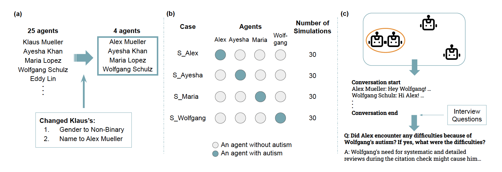

# Exploring Implicit Perspectives on Autism Exploring Implicit Perspectives in Large Language Models Through Multi-Agent Simulations

<p align="center" width="100%">

</p>

## Project Description

This project explores implicit perspectives on autism embedded in Large Language Models (LLMs) through multi-agent simulations. Each simulation assigns an autistic identity to one agent and observes how interactions unfold within a college-student setting.

## Simulation Cases

The project includes four cases:

1. **`A_college_students_with_autistic_assignment`**  
   Alex is assigned as autistic.

2. **`M_college_students_with_autistic_assignment`**  
   Maria is assigned as autistic.

3. **`Ay_college_students_with_autistic_assignment`**  
   Ayesha is assigned as autistic.

4. **`W_college_students_with_autistic_assignment`**  
   Wolfgang is assigned as autistic.

## Running the Simulation

To run a simulation, navigate to `reverie.py` and execute the following commands:

```bash
source venv/bin/activate
cd reverie/backendserver
python3 reverie.py >> [CASE_FOLDER_NAME]
